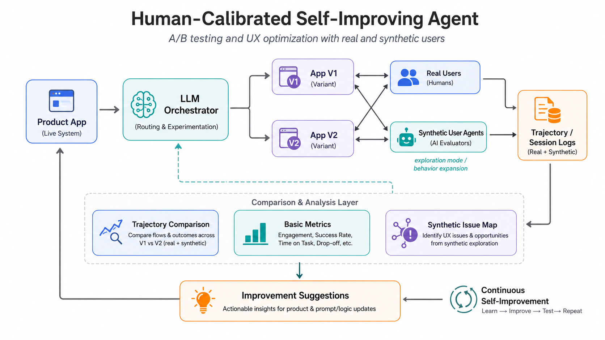
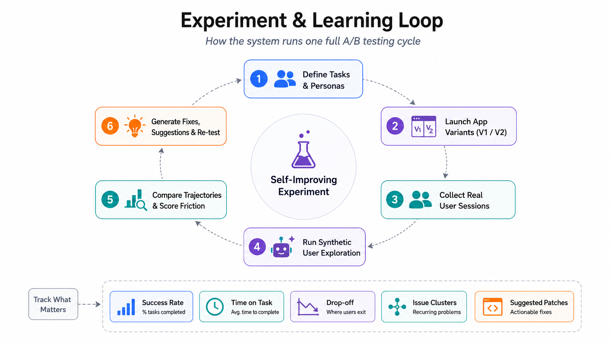
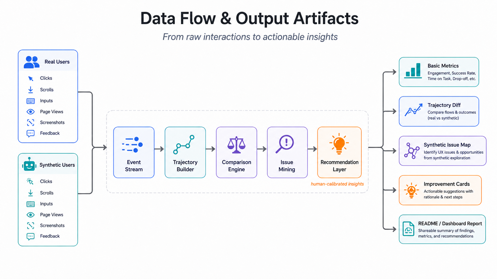

# Hackathon3 Website Variants

This repo is a unified Next.js app for comparing two website variants under the
same access pattern.

## Routes

- `/versionA` renders the Staybnb booking prototype from `TEST_WEBSITE_A`.
- `/versionB` renders the original StayFinder rental gallery SPA from the
  initial repository commit, adapted to React with clickable modal actions.
- `/eval` renders the Airbnb archive/version browser as a dynamic React page.
- `/synthetic` renders the synthetic user behavior inspector.
- `/` redirects to `/versionA`.

The intended local URLs are:

- `http://localhost:3000/versionA`
- `http://localhost:3000/versionB`
- `http://localhost:3000/eval`
- `http://localhost:3000/synthetic`

If another process is using port 3000, run the app on another port and use the
same route paths, for example `http://localhost:3100/eval`.

## Development

Install dependencies:

```bash
npm ci
```

Run the development server on the default port:

```bash
npm run dev
```

Run on a specific port:

```bash
npm run dev -- --hostname 127.0.0.1 --port 3100
```

## Verification

Run lint:

```bash
npm run lint
```

Run a production build:

```bash
npm run build
```

Run Playwright tests:

```bash
npx playwright test
```

If port 3000 is occupied, use:

```bash
PORT=3100 npx playwright test
```

<!-- USER TWIN README PACKAGE START: appended from usertwin_readme_package.zip; existing README content above is preserved. -->

# UserTwin: Human-Calibrated Self-Improving UX Agent

**A/B testing with real users, synthetic users, and self-improving product feedback loops.**

UserTwin is a human-calibrated self-improving UX research agent. It combines real user sessions, synthetic user agents, A/B testing, trajectory comparison, and automated improvement suggestions into one continuous experimentation loop.

The key idea is not to replace human users with agents. Instead, UserTwin uses a small number of real user sessions as behavioral anchors, then scales UX exploration with synthetic user agents. This makes agent-driven product testing more trustworthy, repeatable, and actionable.

---

## Project Overview

The system starts with a product app, such as a simplified Airbnb-like booking interface. Real users and synthetic agents complete the same tasks across two app variants. Their clicks, scrolls, inputs, page views, screenshots, feedback, and task outcomes are transformed into structured trajectories.

The system then compares real and synthetic behavior, identifies UX friction, generates issue maps, and proposes product improvements. These recommendations can be used to update the product interface, improve agent prompts or logic, and re-run the same experiment to evaluate whether the new version performs better.

For the hackathon demo, the product environment is a simplified short-term rental search app called **StayLab**. Users and agents are asked to complete realistic booking tasks, such as searching for a budget stay, applying filters, comparing listings, checking total price, and completing a mock checkout.

---

## Why This Matters

Traditional UX testing is reliable but slow and expensive. Traditional A/B testing is quantitative but usually requires large amounts of traffic. Pure LLM-based user simulation is scalable, but it is difficult to trust without human behavioral evidence.

UserTwin connects these approaches:

- **Real user sessions** provide behavioral grounding.
- **Synthetic user agents** provide scalable exploration.
- **A/B testing** provides a controlled comparison structure.
- **Trajectory analysis** converts raw interaction data into measurable evidence.
- **Self-improvement loops** turn UX issues into product recommendations and re-tests.

The result is an agentic UX research system that can test, compare, diagnose, and improve digital products before large-scale deployment.

---

## System Architecture



The product app is routed through an LLM orchestrator, which manages app variants, user tasks, agent personas, and evaluation logic. Real users and synthetic user agents interact with App V1 and App V2. Their sessions are converted into trajectory logs.

The comparison layer analyzes behavior across variants and user types. It produces basic metrics, trajectory comparisons, synthetic issue maps, and improvement suggestions. These suggestions are then fed back into the product app and the LLM orchestrator for continuous improvement.

---

## Experiment & Learning Loop



Each experiment follows a six-step loop:

1. **Define tasks and personas**
   Create realistic user goals, such as budget traveler, family planner, pet owner, or remote worker.

2. **Launch app variants**
   Run App V1 and App V2 as controlled A/B variants.

3. **Collect real user sessions**
   Record opt-in human sessions, including interaction events and task outcomes.

4. **Run synthetic user exploration**
   Let LLM-driven agents complete the same tasks across both variants.

5. **Compare trajectories and score friction**
   Compare paths, failures, drop-offs, hesitation, repeated actions, and task success.

6. **Generate fixes, suggestions, and re-test**
   Convert observed friction into improvement cards, product patches, or prompt/logic updates, then run the experiment again.

This loop allows the system to learn from both human behavior and agent-driven exploration.

---

## Data Flow & Output Artifacts



Both real and synthetic users generate interaction events, including clicks, scrolls, inputs, page views, screenshots, and feedback. These events are streamed into a trajectory builder, processed by a comparison engine, mined for UX issues, and transformed into human-calibrated recommendations.

The final outputs include:

- **Basic Metrics**: success rate, engagement, time on task, drop-off, step count, and friction count.
- **Trajectory Diff**: path differences between V1 and V2, and between real and synthetic users.
- **Synthetic Issue Map**: UX issues and edge cases discovered through agent exploration.
- **Improvement Cards**: actionable suggestions with evidence, rationale, and next steps.
- **README / Dashboard Report**: shareable experiment summary for product teams or hackathon judges.

---

## Demo App: StayLab

For the hackathon demo, we use a simplified short-term rental search app called **StayLab**. It is not intended to replicate Airbnb as a full product. Instead, it provides a realistic testbed for multi-step UX decisions.

Example user tasks:

- Find a two-night stay for two people under a target budget.
- Find a pet-friendly stay with parking.
- Compare two listings based on total price, rating, and cancellation policy.
- Complete a mock checkout and confirm the final price.

The baseline version intentionally includes common UX frictions, such as:

- Total price is shown too late in the checkout flow.
- Filter access is not prominent enough.
- Listing cards do not expose key decision-making information.
- Checkout summary is weak or visually separated from the main action.
- Users need to move back and forth between listing detail and search results.

The improved version applies system-generated suggestions and is re-tested by both real users and synthetic agents.

---

## Human Calibration

UserTwin does not assume that synthetic agents are automatically correct. Instead, it uses real user sessions to calibrate and validate agent behavior.

The system compares four types of signals:

1. **Outcome direction**
   If real users perform better on V2, do synthetic agents observe the same direction of improvement?

2. **Path similarity**
   Do real and synthetic users follow similar action sequences, such as search → filter → listing detail → checkout?

3. **Friction overlap**
   Do agents reproduce the same UX frictions observed in real user sessions?

4. **Synthetic-only issue rate**
   Are agents producing too many issues that were not grounded in human behavior?

This makes the system more reliable than a purely synthetic UX evaluator.

---

## Evaluation Metrics

We evaluate the system using both product metrics and calibration metrics.

### Product Metrics

- Task success rate
- Time on task
- Step count
- Drop-off rate
- Friction events
- Checkout completion rate
- Repeated actions or backtracking

### Calibration Metrics

- Human-agent direction agreement
- Trajectory similarity
- Friction overlap
- Synthetic-only issue rate
- Human-grounded issue recall

A useful synthetic agent is not one that behaves exactly like a person in every click. Instead, it should reproduce the main task outcomes, friction points, and improvement direction observed in real sessions.

---

## Example Trajectory Schema

```json
{
  "session_id": "human_003",
  "actor_type": "human",
  "variant": "A",
  "task": "find_budget_stay",
  "events": [
    {
      "t": 0.0,
      "type": "page_view",
      "page": "/search"
    },
    {
      "t": 3.2,
      "type": "click",
      "role": "button",
      "label": "Filters",
      "selector": "[data-testid='filter-button']"
    },
    {
      "t": 8.6,
      "type": "scroll",
      "depth": 0.42
    },
    {
      "t": 12.1,
      "type": "friction",
      "label": "repeated_filter_toggle"
    }
  ],
  "outcome": {
    "success": false,
    "time_to_complete_sec": 94,
    "step_count": 27,
    "friction_count": 5
  }
}
```

---

## Suggested Repository Structure

```text
.
├── README.md
├── assets/
│   ├── system_architecture.png
│   ├── experiment_loop.png
│   └── data_flow.png
├── app/                    # Product app / frontend
├── agents/                 # Synthetic user agents and orchestration logic
├── lib/                    # Shared utilities
├── data/                   # Mock listings and sample trajectories
└── reports/                # Generated experiment summaries
```

## Privacy and Safety

The demo uses a mock product environment with synthetic listings and mock checkout. No real payments, accounts, addresses, or sensitive personal data are collected.

Recommended safety rules:

- Use opt-in session recording only.
- Avoid collecting real names, emails, phone numbers, addresses, payment information, or passwords.
- Mask input values unless they are necessary for analysis.
- Keep the agent inside a controlled test environment.
- Do not run autonomous agents on third-party production websites.

---

<!-- USER TWIN README PACKAGE END -->

## Synthetic user behavior

`actor=agent` in the URL only labels captured events as agent activity. The
profile-based synthetic behavior model lives in `src/lib/syntheticUser.ts`.

It projects behavior from:

- a synthetic profile, such as `budget_planner`, `policy_checker`, or
  `quick_booker`
- a UX task, such as `find_budget_stay` or `compare_cancellation`
- the current screen, selected listing, filters, and action history

For each step the model scores candidate actions with task relevance,
preference match, effort penalty, and risk penalty. It then samples the next
action using the profile's exploration level. Dwell time is estimated from the
screen base time, visible complexity, task pressure, profile patience/speed, and
deterministic jitter.

## Synthetic A/B self-improvement

`src/lib/syntheticOptimization.ts` runs the synthetic profiles across Variant A
and Variant B, aggregates completion, dwell, abandon, and friction rates, then
turns the collected feedback into ranked UX changes. The `/synthetic` page shows
the A/B scorecard, the current winner, and a projected self-improved variant
that applies the highest-impact recommendations as synthetic score and dwell
adjustments.
