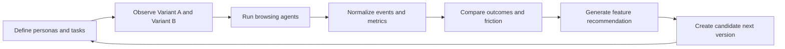

# Agentic A/B Lab

Agentic A/B Lab is a hackathon prototype for testing product changes with
synthetic browsing agents before relying on slow, privacy-sensitive human
traffic experiments.

The motivating question is simple:

> What if product teams could A/B test a feature by sending many realistic
> user-like agents through the experience, then inspect the full evidence behind
> every recommendation?

This repo applies that idea to a short-stay booking product called **Staybnb**.
It includes product variants, synthetic user profiles, browser-observed agent
traces, a Modal-backed agent dashboard, a standalone A/B dashboard, and a loop
that turns synthetic feedback into a next feature candidate.

Built for the [Autoresearch Systems Hackathon with Modal, OpenAI, Raindrop &
Antler](https://luma.com/fvz1h1dq), where the prompt was to build systems that
help agents plan, search, synthesize information, and improve over longer
horizons.

## Why This Exists

Traditional product A/B testing is powerful, but it has sharp limits for modern
agent-facing products:

- **Privacy limits observability.** Human cursor movement, hesitation, dwell
  patterns, and page-level attention can be sensitive or unavailable.
- **Signals are hard to interpret.** Click rate, dwell time, conversion, survey
  feedback, and drop-off can point in different directions, often requiring a
  data scientist to decide what happened.
- **Most tests are human-first.** A feature that works for a person may still
  confuse an autonomous browsing agent acting on behalf of that person.
- **The loop is slow.** Waiting for enough real traffic makes early product
  iteration expensive.

This project explores a complementary loop: run controlled browsing agents with
different goals and decision styles through each variant, capture what they saw,
what they did, where they hesitated, and why they chose one path over another.

## What This Repo Demonstrates

The demo compares feature variants using synthetic browsing patterns generated
from different user profiles. Each run produces structured evidence that can be
inspected instead of treated as a black-box metric.

The prototype shows four useful properties:

- **Full session visibility.** Agent runs can expose page context, visible text,
  candidate actions, traces, feedback, operation logs, and generated metrics.
- **More interpretable decisions.** Recommendations are backed by trajectory
  evidence such as friction themes, task completion, dwell time, step count,
  issue lists, and final user-like feedback.
- **Agent-ready evaluation.** The system tests whether an experience is legible
  to agents, not only whether it looks good to humans.
- **Scalable experimentation.** Modal can run cloud Playwright agents across
  public A/B URLs, while local fallback data keeps the demo reviewable.

## Product Under Test

The product is a simplified Airbnb-like booking flow.

- `/versionA` renders **Staybnb**, a task-first baseline with search, filters,
  listing details, checkout, and UX event capture.
- `/versionB` renders **StayFinder**, a more gallery-led browsing experience
  adapted from an earlier SPA.
- `/dashboard` renders the Modal UserTwin dashboard for cloud agent runs across
  A/B URLs.
- `/synthetic` renders the in-app synthetic behavior inspector and
  self-improvement projection.
- `/eval` renders an Airbnb-style archive/version browser.
- `AB experiment/` contains a standalone synthetic A/B dashboard and runner for
  external A/B URLs.

The current committed synthetic run compares hosted A/B pages and stores the
normalized result in:

```text
AB experiment/data/latest_ab_run.json
AB experiment/data/runs/
```

## How The Loop Works



1. **Define synthetic users.** Profiles represent distinct browsing patterns:
   budget traveler, pet owner, family planner, remote worker, experience seeker,
   cautious first-time user, and deterministic in-app profiles such as
   `budget_planner`, `policy_checker`, and `quick_booker`.
2. **Observe each page.** The standalone runner uses Playwright to capture page
   title, visible text, headings, buttons, links, inputs, forms, CTAs, pricing
   text, trust signals, and clickable elements.
3. **Run agent sessions.** Agents receive the observed page context or scripted
   task case and produce step-by-step browsing traces for A and B.
4. **Compute metrics.** The system scores completion, conversion intent, dwell
   time, friction, click behavior, likes/saves, satisfaction, and issue themes.
5. **Explain the winner.** Dashboards show the winning variant, confidence,
   metric deltas, attribution themes, top issues, and suggested changes.
6. **Close the loop.** The suggestion panel can generate a local next-version
   route from the strongest synthetic feedback.

## Repository Map

```text
.
|-- src/app/
|   |-- versionA/              # Staybnb baseline route
|   |-- versionB/              # StayFinder comparison route
|   |-- dashboard/             # Modal UserTwin dashboard
|   |-- synthetic/             # Synthetic behavior inspector
|   |-- eval/                  # Archive/version browser
|   `-- api/modal/run-agents/  # Next API bridge to Modal
|-- src/data/
|   |-- personas.ts
|   |-- tasks.ts
|   `-- sampleModalResults.json
|-- src/lib/
|   |-- syntheticUser.ts       # Deterministic synthetic profile model
|   |-- syntheticOptimization.ts
|   |-- buildExperimentCases.ts
|   |-- summarizeAgentResults.ts
|   |-- improvementCards.ts
|   |-- analytics.ts
|   `-- friction.ts
|-- modal_app/
|   |-- agent_runner.py        # Modal Playwright runner endpoint
|   `-- test_agent_runner.py
|-- AB experiment/
|   |-- server.py              # Local synthetic A/B dashboard server
|   |-- app.js                 # Dashboard UI
|   |-- synthetic_user/        # Runner UI
|   |-- scripts/
|   |   |-- observe_page.mjs
|   |   |-- airbnb_synth_demo.py
|   |   |-- normalize_ab_run.py
|   |   `-- generate_version.py
|   `-- data/                  # Latest and historical synthetic runs
|-- tests/                     # Playwright coverage
`-- assets/usertwin-readme/    # Supporting diagrams
```

## Run The Next App

Install dependencies:

```bash
npm ci
```

Start the app:

```bash
npm run dev
```

Open:

```text
http://localhost:3000/versionA
http://localhost:3000/versionB
http://localhost:3000/dashboard
http://localhost:3000/synthetic
http://localhost:3000/eval
```

If port `3000` is busy:

```bash
npm run dev -- --hostname 127.0.0.1 --port 3100
```

## Run The Modal Agent Dashboard

The `/dashboard` page runs cloud Playwright agents against public A/B URLs and
summarizes success rate, average time, friction, top issues, improvement cards,
and per-run operation logs.

Modal cannot access `localhost` from the cloud, so expose the app through a
public tunnel when testing locally:

```bash
npm run dev -- --hostname 0.0.0.0 --port 3000
npx --yes cloudflared tunnel --url http://127.0.0.1:3000
```

Use the generated public URLs in the dashboard:

```text
https://<tunnel>.trycloudflare.com/versionA
https://<tunnel>.trycloudflare.com/versionB
```

Configure the Modal endpoint in `.env.local`:

```env
MODAL_AGENT_URL=https://your-modal-endpoint.modal.run
```

Deploy the runner:

```bash
modal deploy modal_app/agent_runner.py
```

The dashboard also has a fallback demo mode backed by
`src/data/sampleModalResults.json`, so reviewers can inspect the output shape
without deploying Modal.

## Run The Standalone Synthetic A/B Dashboard

The standalone dashboard serves the committed sample immediately:

```bash
python3 "AB experiment/server.py" --port 8765
```

Open:

```text
http://127.0.0.1:8765/AB%20experiment/
http://127.0.0.1:8765/AB%20experiment/synthetic_user/
```

To run a fresh experiment, enter two URLs in the Synthetic Users page. For
example:

```text
A URL: http://localhost:3000/versionA
B URL: http://localhost:3000/versionB
Profiles: 20
Runs: 5
Model: auto
Timeout: 240s
```

The server writes:

```text
AB experiment/data/runs/<job_id>_A.out
AB experiment/data/runs/<job_id>_B.out
AB experiment/data/runs/<job_id>.json
AB experiment/data/latest_ab_run.json
```

## Data Shape

The standalone A/B result uses `synthetic_ab_run_v1` and includes:

- `config`: A/B URLs, profile count, run count, model, and timeout.
- `variants.A` and `variants.B`: page context, traces, derived metrics,
  feedback, and recommendations.
- `matrix_summary`: winner, confidence, headline metrics, attribution themes,
  and suggested next steps.
- `phase_history`: observation, profile generation, trajectory generation,
  feedback summarization, and completion timing.

The Modal dashboard API returns:

- `source`: `modal`, `fallback`, or a fallback-after-error label.
- `totalRuns`: total agent cases completed.
- `results`: per-run variant, persona, task, events, issues, friction count,
  and success value.
- `summary`: per-variant success rate, average time, friction, issues, and
  aggregate comparison data.

The in-app UX event schema lives in `src/lib/analytics.ts` and records local
events such as page views, clicks, inputs, modal opens, filter application,
listing opens, checkout starts, checkout success, and friction events. Add
`?actor=agent&task=complete_checkout&variant=A` to a URL to label captured
events for agent evaluation.

## Synthetic Profiles

There are three complementary profile systems:

- `src/data/personas.ts` and `src/data/tasks.ts` define the Modal dashboard
  matrix.
- `src/lib/syntheticUser.ts` provides deterministic, explainable synthetic
  behavior for the Next `/synthetic` page and Playwright tests.
- `AB experiment/scripts/airbnb_synth_demo.py` generates browser-observed
  synthetic profiles and traces for arbitrary A/B URLs, with deterministic
  fallback behavior if the LM path is unavailable.

The deterministic model scores candidate actions using task relevance,
preference match, effort penalty, risk penalty, experience adjustments, and
seeded sampling. It also explains dwell time using screen complexity, policy
pressure, price pressure, action uncertainty, profile patience, profile speed,
and deterministic jitter.

## Validation

Run lint:

```bash
npm run lint
```

Run a production build:

```bash
npm run build
```

Run Playwright tests:

```bash
npx playwright test
```

Run Modal runner unit tests:

```bash
python3 -m unittest modal_app/test_agent_runner.py
```

Validate the standalone synthetic runner files:

```bash
python3 -m py_compile "AB experiment/server.py"
python3 -m py_compile "AB experiment/scripts/airbnb_synth_demo.py"
python3 -m py_compile "AB experiment/scripts/normalize_ab_run.py"
node --check "AB experiment/scripts/observe_page.mjs"
node --check "AB experiment/app.js"
node --check "AB experiment/synthetic_user/app.js"
python3 -m json.tool "AB experiment/data/latest_ab_run.json" >/dev/null
```

## Safety Notes

This repo uses mock listings and mock checkout. It should not enter payment
details, create accounts, message hosts, or submit real personal data.

For real product studies:

- Use opt-in human session collection.
- Avoid collecting names, emails, addresses, payment data, or passwords.
- Mask input values unless they are essential to the research question.
- Keep agents inside controlled test or staging environments.
- Treat synthetic results as decision support, not as a replacement for all
  human evidence.

## Where This Could Go

- Run larger synthetic cohorts on Modal for faster exploration.
- Calibrate synthetic traces against opt-in human sessions.
- Add model-graded trajectory similarity and friction overlap.
- Promote generated feature candidates into real variant branches.
- Support A/B/C testing and repeated self-improvement cycles.
